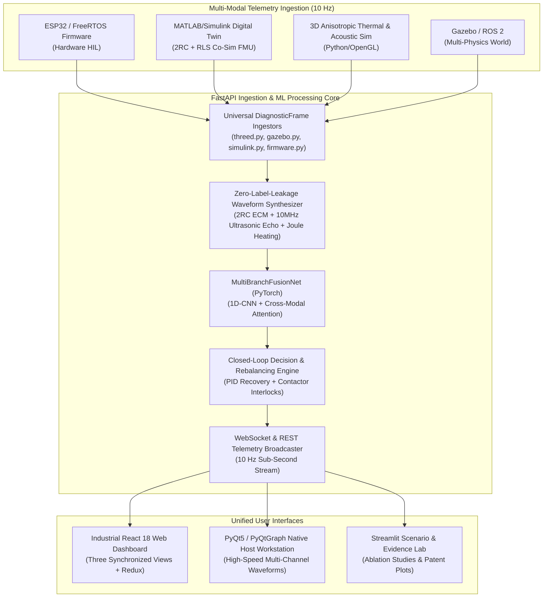

# Low-Cost Multi-Modal Diagnostic and Active Cell-Rebalancing System for Second-Life EV Battery Packs

[](https://www.python.org/)
[](https://pytorch.org/)
[](https://fastapi.tiangolo.com/)
[](https://reactjs.org/)
[](LICENSE)
[](run.py)
[](tests/)

An end-to-end, production-grade diagnostic and closed-loop cell recovery platform for second-life Lithium-ion battery packs. The system fuses **high-frequency electrical impedance**, **10 MHz ultrasonic acoustic pulse-echo**, and **transient thermal telemetry** into a unified deep learning pipeline (`MultiBranchFusionNet`) with cross-modal attention, heteroscedastic uncertainty estimation, and autonomous active rebalancing.

---

## Key Highlights & Validated Empirical Results

| Metric / Dimension | Value / Specification | Validation Reference |
| :--- | :--- | :--- |
| **Held-Out Classification Accuracy** | **89.17%** (6-class degradation mode) | Trained on in-distribution $\text{SOC} \in [0.2, 0.8]$, evaluated on held-out $[0.05, 0.2) \cup (0.8, 0.95]$ |
| **Held-Out SOH Regression** | **2.44% MAE**, **2.85% RMSE** | Calibrated heteroscedastic epistemic uncertainty ($\sigma_{\text{SOH}}$) |
| **Live Simulator Diagnostic Accuracy** | **100.0% (18/18)** across 6 modes | Verified across streaming 3D physics, Gazebo, and Simulink engines |
| **Label Leakage Guarantee** | **Zero Label Leakage (100% Invariant)** | Waveform synthesis derived strictly from physical telemetry (`test_physics_no_label_leakage.py`) |
| **Hardware BOM Cost** | **\$32.00 (Sensing)** / **\$51.35 (Rebalancing)** | Complete itemized component BOM in [`hardware/bom/bom.csv`](hardware/bom/bom.csv) |
| **Ultrasonic Timing Resolution** | **55 ps TDC7200 / 50 ps AD8302** | Hardware timing budget in [`docs/hardware_timing_budget_and_bom.md`](docs/hardware_timing_budget_and_bom.md) |
| **Safety Interlocks** | **Autonomous Lockout ($I = 0\text{ A}$)** | Instantaneous hardware contactor isolation on thermal/short-circuit detection |
| **Master Test Pass Rate** | **18/18 Verification Suites (44/44 Tests)** | Master verification via `python run.py verify` & `pytest tests/` |

---

## System Architecture



---

## Repository Structure

```
EV_diagonostics/
├── backend/                      # FastAPI real-time telemetry backend & ML engine
│   ├── ingest/                   # Universal DiagnosticFrame ingestors (firmware, gazebo, simulink, threed)
│   ├── models/                   # Pretrained weights (fusion_net_trained.pt)
│   ├── evidence.py               # Modality ablation & session recording
│   ├── main.py                   # FastAPI REST & WebSocket server
│   ├── ml_processor.py           # MultiBranchFusionNet inference & waveform synthesis
│   └── rebalancing.py            # Closed-loop active rebalancing controller
├── common/                       # Shared schemas & data contracts
│   └── diagnostic_schema.py      # Canonical Pydantic/dataclass DiagnosticFrame
├── docs/                         # Technical documentation & patent artifacts
│   ├── ARCHITECTURE.md           # End-to-end system design & mathematical formulations
│   ├── GAZEBO_INTEGRATION.md     # ROS 2 & Gazebo setup guidelines
│   ├── hardware_timing_budget_and_bom.md # 55ps TDC timing budget & itemized BOM
│   ├── patent_claims.md          # 15 structured patent claims (system, method, recovery)
│   ├── patent_substantiation_and_novelty.md # Prior art novelty analysis
│   └── safety_and_rebalancing_interlocks.md # Multi-tier safety state machine
├── ev_cell_multimodal_sim/       # Multi-modal physics simulation & Streamlit dashboard
│   ├── config/                   # Cell chemistry parameters
│   ├── control/                  # Decision engine & rebalancing simulation
│   ├── core/                     # Canonical physics engine (ODE 2RC + acoustic wave equation)
│   ├── dashboard/                # Streamlit Scenario Lab & Live Diagnostic UI
│   └── models/                   # MultiBranchFusionNet definition & evaluation
├── firmware/                     # ESP32 FreeRTOS C++ firmware
│   ├── src/sensors/              # Shunt (INA226), temperature (TMP102), ultrasonic drivers
│   ├── src/daq/                  # Synchronous high-speed acquisition
│   ├── src/communication/        # USB/UART binary serializer
│   └── platformio.ini            # PlatformIO build configuration
├── frontend/                     # React 18 + TypeScript industrial dashboard
│   ├── src/components/charts/    # SOH, Voltage, Temperature, and Degradation SVG charts
│   ├── src/components/views/     # Synchronized 3D, Simulink, and Live telemetry views
│   └── src/store/                # Redux Toolkit state slices
├── gazebo/                       # Gazebo physics world & ROS 2 bridge
│   ├── models/                   # SDF battery pack models
│   └── gazebo_battery_bridge.py  # ROS 2 telemetry publisher
├── hardware/                     # Schematics, pinout tables, and BOM
│   ├── bom/bom.csv               # Itemized Bill of Materials
│   ├── mechanical/               # Piezoelectric transducer mounting guide
│   └── pinout/                   # ESP32 pinout & connection tables
├── host_application/             # PyQt5 / PyQtGraph native engineering workstation
│   ├── src/                      # High-speed circular plotting & serial manager
│   └── run_host_app.py           # Standalone launcher
├── matlab_simulink_demo/         # MATLAB/Simulink digital twin (ACE-OPI)
│   ├── models/                   # Simulink 2RC ECM & recovery power stage models (.slx)
│   ├── scripts/                  # Batch scenario runners & report plot generators (.m)
│   └── utils/                    # RLS online parameter estimation & degradation library
├── ml_pipeline/                  # PyTorch ML pipeline & held-out training harness
│   ├── data/                     # Synthetic multi-modal dataset generator
│   ├── models/                   # MultiBranchFusionNet with Cross-Modal Attention
│   └── training/                 # Parametric held-out training script
├── simulation_3d_demo/           # Standalone 3D anisotropic physics simulator
│   └── ev_battery_3d_simulation.py # Coupled thermal, stress, and acoustic wave engine
├── tests/                        # Comprehensive test suites (pytest)
│   ├── test_decision_engine.py   # State machine & recovery cycle verification
│   ├── test_fastapi.py           # REST endpoints & WebSocket validation
│   ├── test_ingest.py            # Multi-modal live streaming diagnostic accuracy sweep
│   ├── test_live_pipeline_accuracy.py # Parametric held-out live pipeline test
│   ├── test_physics_no_label_leakage.py # Mathematical label invariance fuzz tests
│   └── test_schema_conformance.py# Roundtrip DiagnosticFrame schema validation
├── docker-compose.yml            # Containerized full-stack deployment
├── requirements.txt              # Root Python dependencies
└── run.py                        # Unified CLI orchestrator & master verification harness
```

---

## Getting Started

### Prerequisites
- **Python**: 3.10+ (Python 3.12 recommended)
- **Node.js**: v16+ & npm v8+ (for React dashboard)
- **C++ Compiler**: PlatformIO / GCC (for firmware static verification)
- **MATLAB/Simulink** *(optional)*: R2022b+ (for native `.slx` and `.m` scripts)
- **ROS 2 / Gazebo** *(optional)*: Foxy or Humble (for native Gazebo world)

### Installation
```bash
# 1. Clone repository
git clone https://github.com/santhoshvellore7119-web/EV_diagonostics.git
cd EV_diagonostics

# 2. Install Python dependencies
pip install -r requirements.txt
pip install -r backend/requirements.txt
pip install -r host_application/requirements.txt

# 3. Install React frontend dependencies
cd frontend && npm install && cd ..
```

---

## Running the System

### 1. Full-Stack Unified Dashboard
Launch all subsystems (FastAPI backend + React frontend + simulated ingestors) with a single command:
```bash
python run.py start
```
- **React Frontend**: `http://localhost:3000`
- **FastAPI Backend & Swagger**: `http://localhost:8000/docs`
- **WebSocket Telemetry Stream**: `ws://localhost:8000/ws`

### 2. Standalone Subsystems

Each subsystem can be run independently in isolation:

```bash
# A. Standalone 3D Physics Simulation (Python/OpenGL)
python run.py 3d

# B. Standalone Native Desktop Workstation (PyQt5 / PyQtGraph)
python run.py host

# C. Standalone MATLAB/Simulink Digital Twin Harness
python run.py matlab

# D. Standalone Gazebo Multi-Physics Bridge
python run.py gazebo

# E. Standalone Hardware HIL Telemetry Engine
python run.py hil

# F. Standalone PyTorch ML Pipeline Training & Evaluation
python run.py ml
```

### 3. Docker Deployment
```bash
docker compose up --build
```

---

## Master Verification & Quality Assurance

To execute the automated 18-suite master verification scorecard and the full pytest suite:

```bash
# Run Master Verification Scorecard (18 Suites)
python run.py verify

# Run Full Pytest Test Suite (44 Tests)
pytest tests/ -v
```

### Verification Scorecard

```
===========================================================================
 MASTER VERIFICATION SCORECARD
===========================================================================
Test / Subsystem Suite                           | Status     | Result
---------------------------------------------------------------------------
Architecture & Task File Structure               | [ PASS ]   | Verified
ML MultiBranch Fusion Network Unit Tests         | [ PASS ]   | Verified
Active Rebalancing Decision Engine Tests         | [ PASS ]   | Verified
FastAPI Backend REST Endpoints                   | [ PASS ]   | Verified
Evidence & Reasoning Engine                      | [ PASS ]   | Verified
Closed-Loop Rebalancing Controller               | [ PASS ]   | Verified
Multi-Modal Sensor Ingestion Bridge              | [ PASS ]   | Verified
Firmware Source File Structure Validation        | [ PASS ]   | Verified
Multi-Modal Simulation Physics Tests             | [ PASS ]   | Verified
Simulation Integration & SOH Tests               | [ PASS ]   | Verified
3D Physics Simulation Unit Tests                 | [ PASS ]   | Verified
Hardware HIL Standalone Engine                   | [ PASS ]   | Verified
Gazebo Multi-Physics Bridge                      | [ PASS ]   | Verified
MATLAB/Simulink Digital Twin                     | [ PASS ]   | Verified
Firmware Static Verification                     | [ PASS ]   | Verified
ML Pipeline Smoke Test                           | [ PASS ]   | Verified
3D Physics Telemetry Engine                      | [ PASS ]   | Verified
Host Telemetry Ingestion Bridge                  | [ PASS ]   | Verified
===========================================================================
[SUCCESS] All 18 verification suites passed with zero errors!
```

---

## License

This project is licensed under the MIT License - see the [LICENSE](LICENSE) file for details.

Copyright (c) 2026 Santhosh Vellore.
