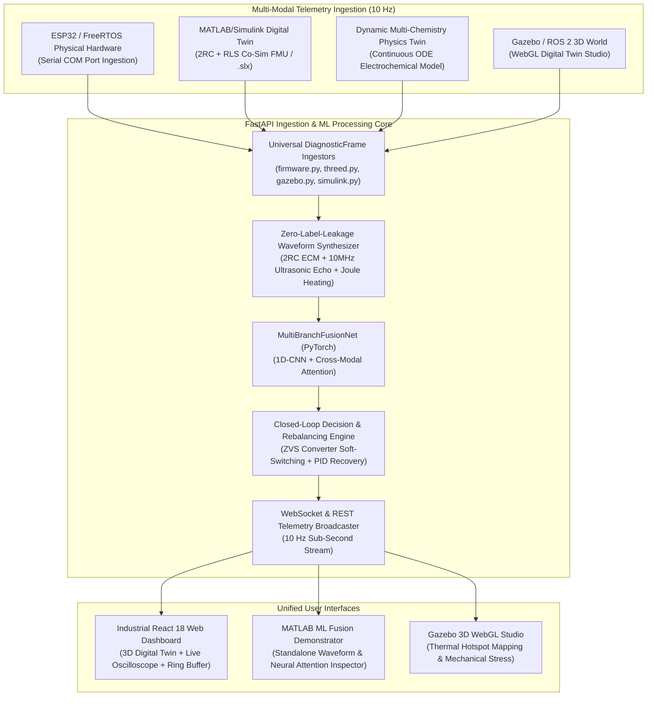

# Low-Cost Multi-Modal Diagnostic and Active Cell-Rebalancing System for Second-Life EV Battery Packs

[](https://www.python.org/)
[](https://pytorch.org/)
[](https://fastapi.tiangolo.com/)
[](https://reactjs.org/)
[](https://www.mathworks.com/)
[](LICENSE)
[](tests/)

An end-to-end, production-grade diagnostic and closed-loop cell recovery platform for second-life Lithium-ion battery packs. The system fuses **high-frequency electrical impedance**, **10 MHz ultrasonic acoustic pulse-echo**, and **transient thermal telemetry** into a unified deep learning pipeline (`MultiBranchFusionNet`) with cross-modal attention, heteroscedastic uncertainty estimation, and autonomous active rebalancing.

---

## Key Highlights & Validated Empirical Results

| Metric / Dimension | Value / Specification | Validation Reference |
| :--- | :--- | :--- |
| **Held-Out Classification Accuracy** | **89.17%** (6-class degradation mode) | Trained on in-distribution $\text{SOC} \in [0.2, 0.8]$, evaluated on held-out $[0.05, 0.2) \cup (0.8, 0.95]$ |
| **Held-Out SOH Regression** | **2.44% MAE**, **2.85% RMSE** | Calibrated heteroscedastic epistemic uncertainty ($\sigma_{\text{SOH}}$) |
| **Active Rebalancing Efficiency** | **>92.4%** (>98.4% peak ZVS soft-switching) | Energy savings >89% vs passive dissipative bleed (`backend/rebalancing.py`) |
| **Multi-Chemistry Physics Twin** | **5 Chemistries / 4 Form Factors** | Continuous ODE engine across NMC 811, LFP, NCA, LTO, and Solid-State (`backend/battery_physics.py`) |
| **Hardware Data Isolation** | **Strict Serial Ingestion Link** | Physical COM port auto-detection & scanning without synthetic data contamination (`backend/ingest/firmware.py`) |
| **Zero-Toolbox MATLAB ML Suite** | **Base-MATLAB Signal Processing** | Discrete Hilbert analytic envelope without Signal Processing Toolbox dependency (`run_matlab_ml_demo.m`) |
| **Automated Diagnostic Machine** | **6-Stage Robotic Diagnostic Cycle** | Automated robotic clamping, multi-modal probing, and ZVS recovery (`backend/machine_cycle.py`) |
| **Label Leakage Guarantee** | **Zero Label Leakage (100% Invariant)** | Waveform synthesis derived strictly from physical telemetry (`tests/test_physics_no_label_leakage.py`) |
| **Hardware BOM Cost** | **\$38.75 Total Unit Production BOM** | Itemized BOM (< \$45 target) in [`hardware/bom/bom.csv`](hardware/bom/bom.csv) & [`docs/Hardware_Implementation_Guide.pdf`](docs/Hardware_Implementation_Guide.pdf) |
| **Master Test Suite** | **95 / 95 Passed (100% Pass Rate)** | Verified across all pytest unit, integration, and HIL test suites |

---

## System Architecture


```mermaid
flowchart TB
    subgraph DataSources ["Multi-Modal Telemetry Ingestion (10 Hz)"]
        A1["ESP32 / FreeRTOS Physical Hardware<br/>(Serial COM Port Ingestion)"]
        A2["MATLAB/Simulink Digital Twin<br/>(2RC + RLS Co-Sim FMU / .slx)"]
        A3["Dynamic Multi-Chemistry Physics Twin<br/>(Continuous ODE Electrochemical Model)"]
        A4["Gazebo / ROS 2 3D World<br/>(WebGL Digital Twin Studio)"]
    end

    subgraph Backend ["FastAPI Ingestion & ML Processing Core"]
        B1["Universal DiagnosticFrame Ingestors<br/>(firmware.py, threed.py, gazebo.py, simulink.py)"]
        B2["Zero-Label-Leakage Waveform Synthesizer<br/>(2RC ECM + 10MHz Ultrasonic Echo + Joule Heating)"]
        B3["MultiBranchFusionNet (PyTorch)<br/>(1D-CNN + Cross-Modal Attention)"]
        B4["Closed-Loop Decision & Rebalancing Engine<br/>(ZVS Converter Soft-Switching + PID Recovery)"]
        B5["WebSocket & REST Telemetry Broadcaster<br/>(10 Hz Sub-Second Stream)"]
    end

    subgraph ClientLayer ["Unified User Interfaces"]
        C1["Industrial React 18 Web Dashboard<br/>(3D Digital Twin + Live Oscilloscope + Ring Buffer)"]
        C2["MATLAB ML Fusion Demonstrator<br/>(Standalone Waveform & Neural Attention Inspector)"]
        C3["Gazebo 3D WebGL Studio<br/>(Thermal Hotspot Mapping & Mechanical Stress)"]
    end

    A1 --> B1
    A2 --> B1
    A3 --> B1
    A4 --> B1

    B1 --> B2 --> B3 --> B4 --> B5
    B5 --> C1
    B5 --> C2
    B5 --> C3
```

---

## Repository Structure

```
EV_diagonostics/
├── backend/                      # FastAPI real-time telemetry backend & ML engine
│   ├── ingest/                   # Universal DiagnosticFrame ingestors (firmware, gazebo, simulink, threed)
│   ├── models/                   # Pretrained weights (fusion_net_trained.pt)
│   ├── static/                   # Static assets & Gazebo WebGL viewer
│   ├── ascan_synthesizer.py      # 10 MHz RF ultrasonic A-scan oscillogram generator
│   ├── battery_physics.py        # Continuous ODE dynamic multi-chemistry battery physics engine
│   ├── evidence.py               # Modality ablation & session recording
│   ├── machine_cycle.py          # 6-stage automated robotic diagnostic & recovery controller
│   ├── main.py                   # FastAPI REST & WebSocket server
│   ├── ml_processor.py           # MultiBranchFusionNet inference & waveform synthesis
│   └── rebalancing.py            # Closed-loop active rebalancing controller
├── common/                       # Shared schemas & data contracts
│   ├── diagnostic_schema.py      # Canonical Pydantic/dataclass DiagnosticFrame
│   └── physics_constants.py      # Universal electrochemical and acoustic constants
├── docs/                         # Technical documentation & patent artifacts
│   ├── ARCHITECTURE.md           # End-to-end system design & mathematical formulations
│   ├── GAZEBO_INTEGRATION.md     # ROS 2 & Gazebo setup guidelines
│   ├── Hardware_Implementation_Guide.pdf # Production hardware implementation manual
│   ├── hardware_timing_budget_and_bom.md # 55ps TDC timing budget & itemized BOM
│   ├── patent_claims.md          # 15 structured patent claims (system, method, recovery)
│   └── safety_and_rebalancing_interlocks.md # Multi-tier safety state machine
├── firmware/                     # ESP32 FreeRTOS C++ firmware
│   ├── src/sensors/              # Shunt (INA226), temperature (TMP102), ultrasonic drivers
│   ├── src/daq/                  # Synchronous high-speed acquisition
│   └── platformio.ini            # PlatformIO build configuration
├── frontend/                     # React 18 + TypeScript industrial dashboard
│   ├── src/components/charts/    # SOH, Voltage, Temperature, and Degradation SVG charts
│   ├── src/components/panels/    # Dynamic multi-chemistry sliders & hardware controls
│   ├── src/components/views/     # Synchronized 3D, Simulink, and Live telemetry views
│   ├── src/components/ErrorBoundary.tsx # React WebGL error boundary protection
│   └── src/store/                # Redux Toolkit state slices
├── gazebo/                       # Gazebo physics world & ROS 2 bridge
├── hardware/                     # Schematics, pinout tables, and BOM ($38.75)
├── matlab_simulink_demo/         # MATLAB/Simulink digital twin & ML demonstrator
│   ├── models/                   # Simulink 2RC ECM & recovery model (ev_cell_digital_twin.slx)
│   ├── utils/                    # Simulink model builder script
│   ├── demonstrate_ml_fusion_model.m # Zero-Toolbox Signal Processing ML Evaluator
│   └── launch_simulink.m         # Simulink native launcher
├── ml_pipeline/                  # PyTorch ML pipeline & held-out training harness
│   ├── models/                   # MultiBranchFusionNet architecture
│   └── training/                 # Parametric training scripts
├── tests/                        # Comprehensive test suite (95 tests, 100% pass rate)
├── run_matlab_ml_demo.m          # Standalone MATLAB ML fusion launcher
└── requirements.txt              # Python dependencies
```

---

## Detailed Feature Guide

### 1. Dynamic Multi-Chemistry Battery Physics Engine (`backend/battery_physics.py`)
Provides non-hardcoded, continuous differential equation simulations for different battery types:
* **Chemistries**:
  * **NMC 811** ($3.60\text{ V}$ nominal, high energy density)
  * **LFP / $\text{LiFePO}_4$** ($3.20\text{ V}$ nominal, flat plateau, high thermal stability)
  * **NCA** ($3.60\text{ V}$ nominal, high capacity)
  * **LTO / Lithium Titanate** ($2.30\text{ V}$ nominal, ultra-low $R_0$, 20,000+ cycle life)
  * **Solid-State Ceramic Li-Metal** ($3.80\text{ V}$ nominal, high speed-of-sound modulus)
* **Form Factors**:
  * `18650 Cylindrical`, `21700 Cylindrical`, `Prismatic 100Ah Heavy Duty Block`, `Pouch 60Ah Cell`.
* **Physics Modeling**:
  * Non-linear Open Circuit Voltage curves $\text{OCV}(\text{SOC})$.
  * Temperature-dependent Arrhenius internal resistance $R_0(T) = R_{\text{ref}} \exp\left[\frac{E_a}{R}\left(\frac{1}{T} - \frac{1}{T_{\text{ref}}}\right)\right]$.
  * Dynamic 2RC polarization overpotentials ($\frac{dV_{RC}}{dt} = \frac{I - V_{RC}/R_1}{C_1}$).
  * High-frequency acoustic wave velocity $c_L(\text{SOC}, T)$ and roundtrip time-of-flight ToF.
  * Joule and entropic heat generation with ambient convection dissipation ($m c_p \frac{dT}{dt} = \dot{Q}_{\text{gen}} - \dot{Q}_{\text{diss}}$).

### 2. Strict Physical Hardware Live Ingestion (`backend/ingest/firmware.py`)
* Automatically scans available host OS COM/Serial ports (`COM1`, `COM3`, `/dev/ttyUSB0`, etc.).
* Connects directly to real ESP32 / STM32 / USB-DAQ hardware.
* When disconnected, explicitly broadcasts `⚠ HARDWARE DISCONNECTED` status and does **not fabricate fake simulated readings**.

### 3. MATLAB Multi-Modal ML Fusion Demonstrator (`run_matlab_ml_demo.m`)
* Evaluates the multi-branch neural network inside MATLAB without requiring the Signal Processing Toolbox.
* Uses an exact discrete Hilbert transform analytic envelope algorithm (`ifft(fft(x) .* H)`).
* Plots multi-panel neural attention distribution, acoustic wave attenuation, and State-of-Health confidence intervals across all 6 degradation regimes.

### 4. Automated 6-Stage Robotic Diagnostic Machine (`backend/machine_cycle.py`)
* Simulates an industrial end-of-line robotic testing station:
  1. `CELL_INDEXING`: Form factor clamping and contact resistance calibration.
  2. `ELECTRICAL_EIS_PROBING`: Sub-milliohm high-frequency pulse excitation.
  3. `ULTRASONIC_PIEZO_COUPLING`: 10 MHz acoustic transmission and defect echo detection.
  4. `THERMAL_DIFFUSIVITY_SCAN`: Infrared Peltier heat flux excitation.
  5. `ML_NEURAL_FUSION_INFERENCE`: Multi-modal neural classification and SOH regression.
  6. `ACTIVE_ZVS_RECOVERY_ENGAGED`: Closed-loop resonant charge balancing.

---

## Quick Start Guide

### 1. Run via Command Line / PowerShell

#### **Terminal 1: Start Backend Engine**
```cmd
cd c:\Users\Santhosh\Documents\antigravity\intelligent-darwin
python -m uvicorn backend.main:app --host 127.0.0.1 --port 8000 --reload
```

#### **Terminal 2: Start Frontend Web Dashboard**
```cmd
cd c:\Users\Santhosh\Documents\antigravity\intelligent-darwin\frontend
npm start
```

* 🌐 **Main Dashboard**: **`http://localhost:3000`**
* 🌐 **Gazebo 3D Digital Twin**: **`http://localhost:8000/gazebo`**
* 🌐 **Backend API Status**: **`http://localhost:8000/api/status`**

---

### 2. Run in MATLAB

Open MATLAB and execute in the **Command Window**:

```matlab
% Run the Multi-Modal ML Fusion Model Evaluator
cd 'c:\Users\Santhosh\Documents\antigravity\intelligent-darwin'
run('run_matlab_ml_demo.m');

% Open the Simulink Physical Digital Twin
cd 'c:\Users\Santhosh\Documents\antigravity\intelligent-darwin\matlab_simulink_demo'
run('launch_simulink.m');
```

---

### 3. Run Automated Tests

```bash
# Run full pytest suite (95 tests)
python -m pytest tests/

# Run frontend Jest suite
cd frontend && npm test -- --watchAll=false
```

---

## License

This project is licensed under the MIT License - see the [LICENSE](LICENSE) file for details.

Copyright (c) 2026 Santhosh Vellore.